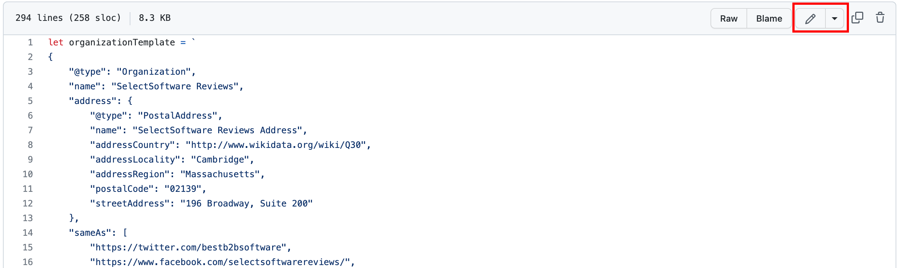
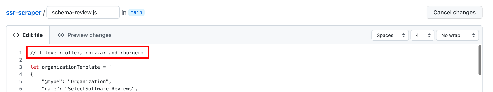
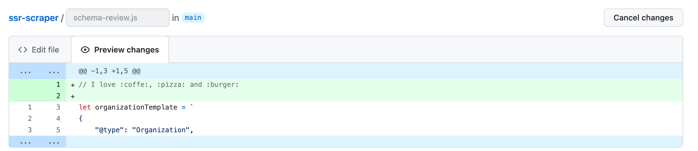
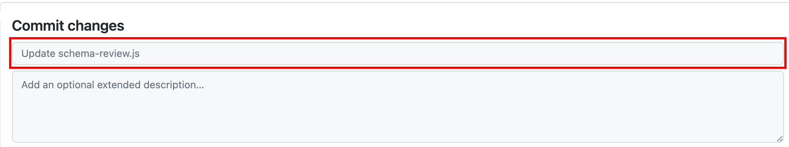
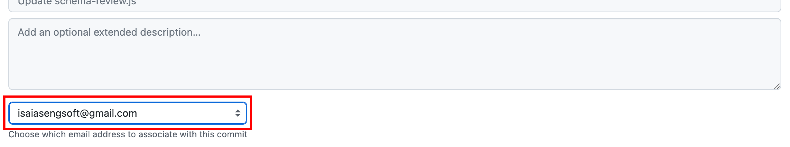
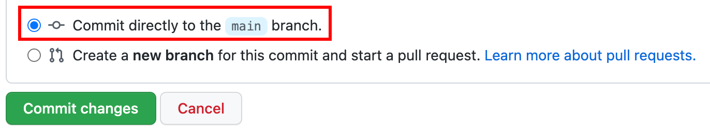
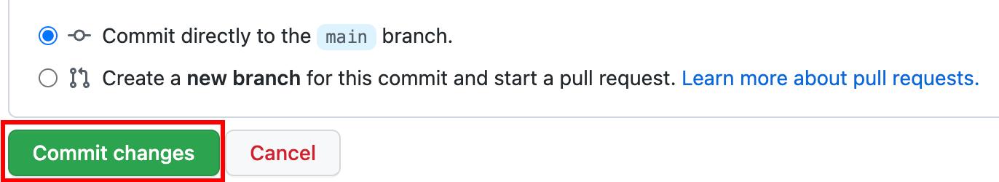

# Editing files in your repository

You can use an editor of your choice, such as [Github Desktop](https://desktop.github.com/) or [Visual Studio Code](https://code.visualstudio.com/) to move your changes to a new branch, commit them, open a pull request, etc. For more information, see [this doc](https://docs.github.com/en/desktop/contributing-and-collaborating-using-github-desktop/making-changes-in-a-branch/committing-and-reviewing-changes-to-your-project).
But in this case, here I will focus on explaining a simpler way to do it through Github itself and without having to download any software for that. Let's go!

1. In your repository, browse to the file you want to edit.
2. In the upper right corner of the file view, click  to :pencil2: open the file editor.

3. On the **Edit file** tab, make any changes you need to the file.

4. Above the new content, click **Preview changes**.

5. At the bottom of the page, type a short, meaningful commit message that describes the change you made to the file.

6. If you have more than one email address associated with your account on GitHub.com, click the email address drop-down menu and select the email address to use as the Git author email address. Only verified email addresses appear in this drop-down menu. If you enabled email address privacy, then `<username>@users.noreply.github.com` is the default commit author email address. For more information, see "[Setting your commit email address](https://docs.github.com/en/account-and-profile/setting-up-and-managing-your-personal-account-on-github/managing-email-preferences/setting-your-commit-email-address)."

7. Below the commit message fields, choose the Commit directly to the main branch option.

8. Click **Commit changes**.

9. Then access this [link](https://github.com/selectingsoftware/ssr-scraper/deployments/activity_log?environment=github-pages) to follow the deployment of your changes.
